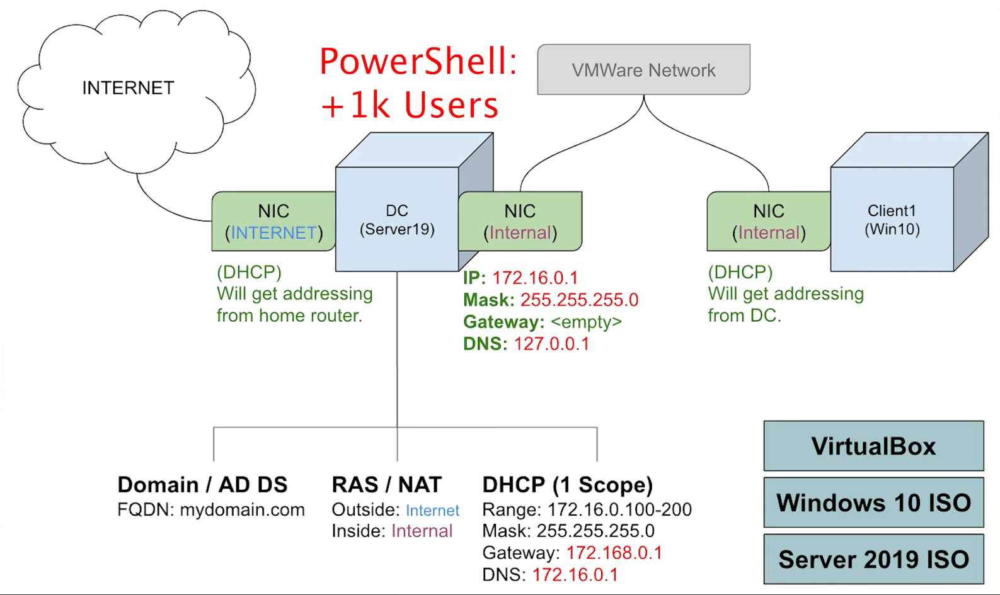
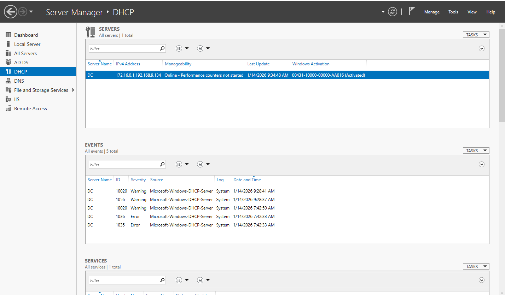
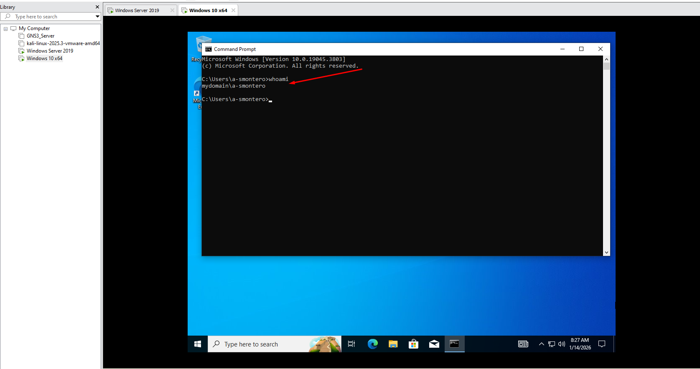
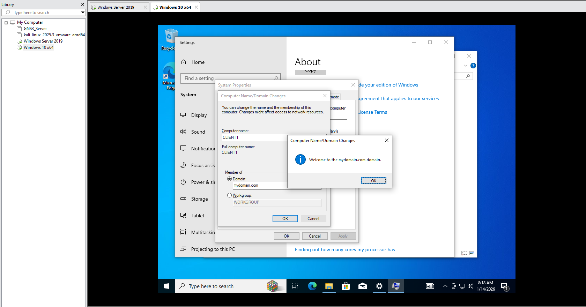

# Active Directory Domain Services

## Overview

In this project, I implemented an Active Directory home lab in a virtualized environment, designed to simulate a basic enterprise Windows infrastructure. My main objective was to build a fully functional domain from scratch to understand the architecture, core services, and administrative processes commonly found in real corporate environments.

**Guide created by me:**
📖 **[Full Deployment Guide – Active Directory Domain Services](GuideBook/GuideBook_Active_Directory.pdf)**

## Network Diagram
In this lab, I designed a network topology where the Domain Controller (DC) uses two network interfaces to separate internal domain communication from external connectivity. The first interface is connected to a NAT network provided by VMware, allowing the server and lab environment to access the Internet for updates and external services without directly exposing the internal network. The second interface is connected to an isolated internal network, dedicated exclusively to communication between the Domain Controller and the client machines within the domain.

The Domain Controller provides essential services within the internal network, including DNS, DHCP, Active Directory Domain Services (AD DS), and Remote Access/NAT, ensuring that client machines receive IP addressing, resolve domain names, and successfully join the domain. This architecture replicates a real-world enterprise network design, offering a controlled, secure, and functional environment for practicing Active Directory administration.

## User Creation Automation with Power Shell Script
Once the domain was fully configured and network connectivity was verified, I implemented automated user creation in Active Directory. To achieve this, I used PowerShell along with a script that imports a list of names from a text file and generates multiple user accounts automatically within the domain.

 

This process replicates a common task in enterprise environments, where administrators must provision large numbers of user accounts efficiently and consistently. Automation not only reduces setup time but also minimizes human error and ensures a standardized account structure across Active Directory.

## DHCP Server Configuration

To ensure that client machines received IP addressing automatically within the internal network, I configured the DHCP server on the Domain Controller. I defined a scope with an address range from 172.16.0.100 to 172.16.0.200, using a subnet mask of 255.255.255.0.

I also set the default gateway to 172.16.0.1, corresponding to the server’s internal network interface, and configured the DNS server with the same address to allow proper domain name resolution. This setup ensured stable network assignment and seamless integration of client machines into the Active Directory environment.

## Joining the Client to the Domain

With network services and Active Directory operating correctly, I proceeded to join the client machine to the domain. First, I verified that the system obtained an IP address from the DHCP server and correctly resolved the domain name through DNS.

 

Next, from the Windows system settings, I entered the domain name and used administrative credentials to complete the domain join process. After restarting the machine, I confirmed that the client was successfully integrated into the domain and that login was possible using the user accounts previously created in Active Directory.

# Full Deployment Guide

This repository provides a high-level overview of the lab and its core configurations. However, for those interested in a deeper exploration of the implementation, I have created a comprehensive technical guide in PDF format. This guide documents each phase of the lab step by step.

The documentation includes configuration screenshots, detailed explanations of deployed services, network architecture, automation scripts, and the validation procedures performed throughout the setup. It is designed for anyone who wishes to fully replicate the lab or use it as a structured learning resource for Active Directory administration.

**Please note:** The full deployment documentation is available at the beginning of the page and is essential to read if you didn’t fully grasp the concepts covered in the lab overview.

